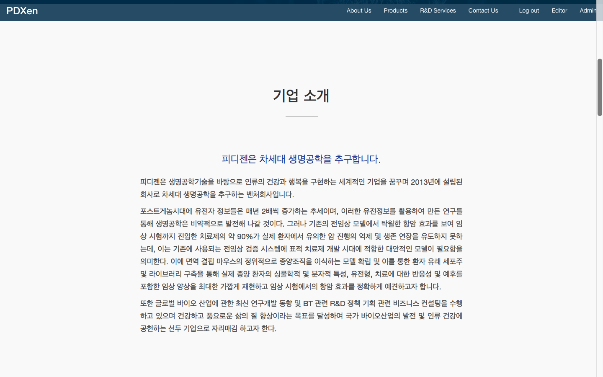

# (주)피디젠 홈페이지

> 유전체 분석 관련 의료 스타트업 (주)피디젠의 홈페이지입니다.  
> Homepage &mdash; <cite>http://pdxen.com</cite>  
> Github Repository &mdash; <cite>https://github.com/K021/pdxen-homepage</cite> (현재 private 상태라 볼 수 없습니다.)

이 프로젝트는 (주)피디젠의 홈페이지로, 회사와 회사의 서비스를 소개하고 바이어들이 쉽게 연락할 수 있도록 하기 위한 목적을 갖고 있으며, 프로젝트 완료 후 인수인계 당시 인수자가 프로그래머가 아니라는 문제를 해결하기 위해, 홈페이지의 글을 쉽게 편집할 수 있는 mark-up 언어인 `Xenmark`를 만들었습니다. 





> [더 많은 이미지 보기](./img/pdxenhomepage)

## 구현된 페이지 및 기능 개괄

- 메인 페이지
	- 스타트업 느낌의 메인페이지 디자인
	- 한 페이지의 회사 소개 메인 페이지
- about, products, services 페이지를 통해 회사와 회사의 서비스 소개
- contacts 페이지를 통한 메일 보내기 기능
- signup 및 login 기능
- editor 페이지에서 xenmark 를 통한 편집 기능
- 모바일 반응형 페이지


# editor 의 xenmark 편집기능

> [Xenmark 사용 가이드](./xenmark-guide-pub.md)

피디젠 홈페이지는 아주 간단한 형태의 웹앱으로, Xenmark 편집 기능을 제외하면 아주 초보적인 수준이라 딱히 상술할 것이 없다. 이 문서에선 어떤 방식으로 xenmark 로 작성된 문자열을 `html` 타입으로 변환하였는지 그 로직을 살펴보기로 한다.

## Xenmark 의 기본적 형태

마크 다운과 비슷하게 하되, 피디젠에 업로드하는 소개글의 형식에 적합하게 설계되었다. 자세한 사항은 [xenmark 사용가이드](./xenmark-guide-pub.md)를 참조하자.

<a id='xenmark-모듈-설명'></a>
중요한 특징으로, `엔터 두번` 으로 단락을 구분하는데, 이하 서술될 문서에 포함된 소스코드에선 이 구분된 한 단락을 `xenmark module` 이라고 부른다.

```
# 가장 큰 제목 (h1)
## 중간 제목 (h2)
### 리딩 문구 (h3)
#### 가장 낮은 단계 제목 (h4)
@이것은 일반문단 입니다. 그 중에 `하이라이트`가 들어있습니다.
[링크 이름](링크 주소)
---
                # 엔터 두 번으로 단락을 구분합니다. 
- 순서 없는 리스트
- 순서 없는 리스트
- 순서 없는 리스트
1. 순서 있는 리스트
2. 순서 있는 리스트
3. 순서 있는 리스트
---
                # 엔터 두 번으로 단락을 구분합니다. 
|2-1|
- 순서 없는 리스트
- 순서 없는 리스트
- 순서 없는 리스트
|2-2|
1. 순서 있는 리스트
2. 순서 있는 리스트
3. 순서 있는 리스트
|2-0|
|(이미지파일명.확장자)|
```

## Xenmark &rarr; Html 변환 예시

##### Xenmark

```
# 가장 큰 제목
### 이것이 리딩입니다. 글의 핵심을 표현하는 부제목이죠.
@ 이것은 일반 문단입니다. 문단 중간에 `하이라이트`가 들어갈 수 있습니다. 
물론 [링크](http://naver.com)도 들어갈 수 있죠. 
가독성을 위해 줄바꿈을 한번 해줘도 상관 없습니다. 하지만 두 번은 안 됩니다.
이런 식으로 글을 계속 작성하다보면 문단을 나눠야 할 필요가 생깁니다.
@ 그럴때는 이렇게 문단을 나누어 주면 깔끔합니다. 
이러한 유전정보를 활용하여 만든 연구를 통해 생명공학은 비약적으로 발전해 나갈 것이다. 그러나 기존의 전임상 모델에서
탁월한 항암 효과를 보여 임상 시험까지 진입한 치료제의 약 90%가 실제 환자에서 유의한 암 진행의
억제 및 생존 연장을 유도하지 못하는데, 이는 기존에 사용되는 전임상 검증 시스템에 표적 치료제 개발
시대에 적합한 대안적인 모델이 필요함을 의미한다. 이에 면역 결핍 마우스의 정위적으로 종양조직을
이식하는 모델 확립 및 이를 통한 환자 유래 세포주 및 라이브러리 구축을 통해 실제 종양 환자의 싱물학적
및 분자적 특성, 유전형, 치료에 대한 반응성 및 예후를 포함한 임상 양상을 최대한 가깝게 재현하고
임상 시험에서의 항암 효과를 정확하게 예견하고자 합니다.
|(genome-analysis.png)|
---

## 두 번째 제목
- 순서 없는 리스트
- 순서 없는 리스트
- 순서 없는 리스트
1. 순서 있는 리스트
2. 순서 있는 리스트
3. 순서 있는 리스트
---

|2-1|
#### 가장 낮은 단계 제목은
- 순서 없는 왼쪽 배열 리스트
- 순서 없는 왼쪽 배열 리스트
- 순서 없는 왼쪽 배열 리스트
|2-2|
#### 이런 곳에 사용하는 겁니다.
1. 순서 있는 오른쪽 배열 리스트
2. 순서 있는 오른쪽 배열 리스트
3. 순서 있는 오른쪽 배열 리스트
|2-0|
``` 

위와 같은 xenmark 문서가 아래와 같이 변환된다. 

##### html

```html
<div class="paragraph text-justify">
    <h1 class="contents">가장 큰 제목</h1>
    <h3 class="contents">이것이 리딩입니다. 글의 핵심을 표현하는 부제목이죠.</h3>
    <p class="contents">이것은 일반 문단입니다. 문단 중간에 <code>하이라이트</code>가 들어갈 수 있습니다. 물론 <a href="http://naver.com">링크</a>도 들어갈 수 있죠. 
    가독성을 위해 줄바꿈을 한번 해줘도 상관 없습니다. 하지만 두 번은 안 됩니다. 이런 식으로 글을 계속 작성하다보면 문단을 나눠야 할 필요가 생깁니다.</p>
    <p class="contents">그럴때는 이렇게 문단을 나누어 주면 깔끔합니다. 이러한 유전정보를 활용하여 만든 연구를 통해 생명공학은 비약적으로 발전해 나갈 것이다. 그러나 기존의 전임상
        모델에서 탁월한 항암 효과를 보여 임상 시험까지 진입한 치료제의 약 90%가 실제 환자에서 유의한 암 진행의 억제 및 생존 연장을 유도하지 못하는데, 이는 기존에 사용되는 전임상 검증
        시스템에 표적 치료제 개발 시대에 적합한 대안적인 모델이 필요함을 의미한다. 이에 면역 결핍 마우스의 정위적으로 종양조직을 이식하는 모델 확립 및 이를 통한 환자 유래 세포주 및
        라이브러리 구축을 통해 실제 종양 환자의 싱물학적 및 분자적 특성, 유전형, 치료에 대한 반응성 및 예후를 포함한 임상 양상을 최대한 가깝게 재현하고 임상 시험에서의 항암 효과를 정확하게
        예견하고자 합니다.</p>
    
    <hr class="margin4">
</div>

<div class="paragraph text-justify">
    <h2 class="contents">두 번째 제목</h2>
    <ul class="contents">
        <li>순서 없는 리스트</li>
        <li>순서 없는 리스트</li>
        <li>순서 없는 리스트</li>
    </ul>
    <ol class="contents">
        <li>순서 있는 리스트</li>
        <li>순서 있는 리스트</li>
        <li>순서 있는 리스트</li>
    </ol>
    <hr class="margin4">
</div>

<div class="paragraph text-justify">
    <div class="paragraph column2-wrapper clearfix text-left">
        <div class="first-column col-md-6">
            <h4 class="contents">가장 낮은 단계 제목은</h4>
            <ul class="contents">
                <li>순서 없는 왼쪽 배열 리스트</li>
                <li>순서 없는 왼쪽 배열 리스트</li>
                <li>순서 없는 왼쪽 배열 리스트</li>
            </ul>
        </div>
        <div class="second-column col-md-6">
            <h4 class="contents">이런 곳에 사용하는 겁니다.</h4>
            <ol class="contents">
                <li>순서 있는 오른쪽 배열 리스트</li>
                <li>순서 있는 오른쪽 배열 리스트</li>
                <li>순서 있는 오른쪽 배열 리스트</li>
            </ol>
        </div>
    </div>
</div>
```

## Xenmark 모듈 구조

> [Xenmark 모듈 소스](files/pdxenhomepage/xenmark)

```
xenmark/
	- __init__.py
	- linef.py		# line 처리 관련 함수를 담고 있는 모듈
	- variables.py	# string pattern, namedtuple 등의 값을 담고 있는 모듈
	- xenmark.py  	# xenmark 모듈 단위의 처리를 하는 함수가 구현된 모듈
```

- `xenmark.py`: 가장 큰 단위의 함수를 가지고 있는 모듈이다. 
	- `xenmark_to_html()`: 아래의 함수를 호출하여 xenmark 문서를 html 문서로 변환한다.
	- `xenmark_modularize()`: xenmark 문서를 단락으로 구분하여 자른다.
	- `module_formatter()`: `linef.py` 의 함수를 사용하여 단락으로 구분된 [xenmark module 하나를](#xenmark-모듈-설명) html 문자열로 변환한다.
- `linef.py`: xenmark 라인 하나를 html 로 변환하는 함수가 정의되어 있다.
- `variables.py`: xenmark 구분자를 특정하기 위한 문자열 패턴 등의 값이 저장되어 있다.


## Xenmark 변환 로직

### Xenmark 는 다음의 변환 로직을 따른다.

1. xenmark 문자열을 단락 단위로 자른다.
2. xenmark 단락을 한 줄 단위로 자른다. 
3. xenmark 한 줄을 html 로 변환한다. 
4. list 타입의 라인을 해당 태그로 감싸준다.
5. 단락을 나타내는 태그로 각 단락을 감싸준다. 
6. 모든 단락을 합쳐 하나의 html 문자열을 반환한다.


## Xenmark.py

### 1. `xenmark.xenmark_to_html`

xenmark 변환의 시작이 되는 함수. xenmark 문자열을 받아 html 문자열을 반환한다.

```python
def xenmark_to_html(string):
    if not isinstance(string, str):
        raise TypeError('input of xenmark_to_html() must be string')

    # xenmark string 을 모듈화한다.
    xenmark_module_list = xenmark_modularize(string)
    html_module_list = [module_formatter(module) for module in xenmark_module_list]
    # 모듈 앞 뒤에 와야 하는 태그를 wrapping 해준다.
    for index, module in enumerate(html_module_list):
        html_module_list[index] = f'<div class="paragraph text-justify">\n{module}\n</div>\n'

    # html 모둘은 끝에 '\n'가 하나 없는 상태로 반환된다. 그래서 붙여주는 것.
    return '\n'.join(html_module_list)
```


### 2. `xenmark.xenmark_modularize`

xenmark 문자열을 받아서 단락별로 구분된 리스트를 반환한다.

```python
def xenmark_modularize(string):
    """
    xenmark string 을 받아서 xenmark module 로 이루어진 list 를 뱉는다.

    :param string: xenmark string
    :return: xenmark module list
    """
    if not isinstance(string, str):
        raise TypeError('input of xenmark_modularize() must be string')

    string = string.replace('\r', '')
    string = string.replace('\ufeff', '')  # window 에서 만든 utf-8 인코딩 문서 맨 앞 기호 지움

    # 줄바꿈 두 개를 기준으로 모듈 분리, 리스트에 할당
    module_list = string.split('\n\n')

    # 줄바꿈 세개가 입력되었을 경우, 줄바꿈 문자로 시작하는 행의 줄바꿈문자 삭제
    for index, value in enumerate(module_list):
        if value.startswith('\n'):
            module_list[index] = value[1:]

    # 내용 없는 모듈 삭제. 줄바꿈이 네개일 때는 내용 없는 모듈이 생김
    while '' in module_list:
        module_list.remove('')

    # 정제된 모듈리스트 반환
    return module_list
```


### 3. `module_formatter`

단락별로 구분된 xenmark 문자열을 html 문자열로 변환한다.

```python
def module_formatter(xenmark_module):
    """
    xenmark module string 을 받아서 html 로 변환해준다.

    :param xenmark_module:
    :return:
    """
    if not isinstance(xenmark_module, str):
        raise TypeError('xenmark_module must be string')

    # paragraph 기호인 @ 아래선, 마음대로 줄바꿈을 할 수 있다
    # 그런데 모듈을 줄바꿈 문자를 기준으로 리스트로 분류할 것이기 때문에,
    # 이 쓸데 없는 개행문자를 전부 없에준다 (공백 한 개로 바꾸어 준다. 줄바꿈은 단락의 전환이므로)
    xenmark_module = PATTERN_REDUNDANT_NEWLINE.sub(' ', xenmark_module)

    lines = xenmark_module.split('\n')
    line_properties = [line_property(line) for line in lines]  # 해당 라인이 header 인지, paragraph 인지 등을 구분
    formatted_lines = []
    for index, line in enumerate(lines):
        line_formatted = line_formatter(line)  # 각 라인 타입에 맞추어 html 변환
        # 리스트의 경우에는 바깥에 한 번 더 감싸주어야 한다.
        if line_properties[index] in [ORDERED_LIST, UNORDERED_LIST, TWO_COLUMN_LIST]:
            line_formatted = list_wrapper(line_formatted, index, line_properties)
        formatted_lines.append(line_formatted)

    html_module = '\n'.join(formatted_lines)
    return html_module
```


## linef.py

### 1. `linef.line_property`

xenmark line 을 받아서 line 타입을 반환한다. 

```python
def line_property(string):
    """
    xenmark line 을 받아서 line 종류를 반환한다.
    :param string: xenmark line
    :return: xenmark line property
    """
    if is_header_1(string):
        return HEADER_1
    elif is_header_2(string):
        return HEADER_2
    elif is_header_3(string):
        return HEADER_3
    elif is_header_4(string):
        return HEADER_4
    elif is_paragraph(string):
        return PARAGRAPH
    elif is_link(string):
        return LINK
    elif is_highlight(string):
        return HIGHLIGHT
    elif is_image(string):
        return IMAGE
    elif is_border_line(string):
        return BORDER_LINE
    elif is_unordered_list(string):
        return UNORDERED_LIST
    elif is_ordered_list(string):
        return ORDERED_LIST
    elif is_two_column_list(string):
        return TWO_COLUMN_LIST
```

### 2. `linef.line_formatter`

xenmark line 을 받아서 html string 으로 변환해준다.

```python
def line_formatter(string):
    """
    xenmark line 을 받아서 html string 으로 변환해준다.
    TWO_COLUMN_LIST 의 경우에는 column variable 을 반환한다.
    :param string: xenmark line
    :return: html string or column variable(str)
    """
    prop = line_property(string)
    formatted = ''

    if prop == HEADER_1:
        formatted = f'<h1 class="contents">{is_header_1(string)}</h1>'
    elif prop == HEADER_2:
        formatted = f'<h2 class="contents">{is_header_2(string)}</h2>'
    elif prop == HEADER_3:
        formatted = f'<h3 class="contents">{is_header_3(string)}</h3>'
    elif prop == HEADER_4:
        formatted = f'<h4 class="contents">{is_header_4(string)}</h4>'
    elif prop == PARAGRAPH:
        formatted = f'<p class="contents">{is_paragraph(string)}</p>'
    elif prop == IMAGE:
        formatted_list = []
        for img_name in is_image(string):
            formatted_list.append(
                ''
            )
        formatted = '\n'.join(formatted_list)
    elif prop == BORDER_LINE:
        formatted = f'<hr class="margin4">'
    elif prop == UNORDERED_LIST:
        formatted = f'<li>{is_unordered_list(string)}</li>'
    elif prop == ORDERED_LIST:
        formatted = f'<li>{is_ordered_list(string)}</li>'
    elif prop == TWO_COLUMN_LIST:
        formatted = is_two_column_list(string)

    # 링크와 하이라이트는 문서 내 어디에든 올 수 있으므로, 한번씩 검사해준다.
    formatted = link_inspector(formatted)
    formatted = highlight_inspector(formatted)

    return formatted
```

`linef.line_formatter` 내부에선, 매번 다음과 같은 함수가 호출된다. 해당 문자열 내에 링크 또는 하이라이트 표시자를 찾아 변환해주는 함수이다.

```python
def link_inspector(line_formatted):
    """
    한 번 formatted 된 line 에 link 타입의 xenmark string 이 있는지 검사한다.
    :param line_formatted:
    :return:
    """
    link_data_list = is_link(line_formatted)
    if link_data_list:
        for link_data in link_data_list:
            html_link = f'<a href="{link_data.address}">{link_data.name}</a>'
            line_formatted = line_formatted.replace(link_data.xenmark, html_link)
    return line_formatted


def highlight_inspector(line_formatted):
    highlight_data_list = is_highlight(line_formatted)
    if highlight_data_list:
        for highlight_data in highlight_data_list:
            html_highlight = f'<code>{highlight_data.content}</code>'
            line_formatted = line_formatted.replace(highlight_data.xenmark, html_highlight)
    return line_formatted
```

### 3. 각 라인의 property 를 검사하는 함수

아래의 함수들은 각 라인의 property 를 검사하고, 해당 될 경우 중요 문자열을 반환한다. 해당되지 않을 경우 아무 것도 반환하지 않는다.

```python
def is_header_1(string):
    """
    True: '#', '#제목', '#   제목'
    Necessary: 맨 앞에 # 하나. 둘 이상 안됨
    Allow: # 뒤에 무제한
    Return: '제목'
    """
    m = PATTERN_HEADER_1.match(string)
    if m:
        return string[m.end():]


def is_header_2(string):
    """
    True: '##', '##제목', '##   제목'
    Necessary: 맨 앞에 # 둘. 셋 이상 안됨
    Allow: ## 뒤에 무제한
    Return: '제목'
    """
    m = PATTERN_HEADER_2.match(string)
    if m:
        return string[m.end():]


def is_header_3(string):
    """
    True: '###', '###제목', '###   제목'
    Necessary: 맨 앞에 # 셋. 넷 이상 안됨
    Allow: ### 뒤에 무제한
    Return: '제목'
    """
    m = PATTERN_HEADER_3.match(string)
    if m:
        return string[m.end():]


def is_header_4(string):
    """
    True: '####', '####제목', '####   제목'
    Necessary: 맨 앞에 # 넷. 다섯 이상 안됨
    Allow: #### 뒤에 무제한
    Return: '제목'
    """
    m = PATTERN_HEADER_4.match(string)
    if m:
        return string[m.end():]


def is_paragraph(string):
    """
    True: '@', '@   이것은 일반 문단입니다.'
    Necessary: 맨 앞에 @
    Allow: @ 뒤 공백 무제한
    Return: '이것은 일반 문단입니다.'
    """
    m = PATTERN_PARAGRAPH.match(string)
    if m:
        return string[m.end():]


def is_link(string):
    """
    True: '[링크](http://naver.com)',
        '물론 [링크](http://naver.com)도 들어갈 수 있죠. 심지어는 두 개도 가능하답니다. [링크2](http://naver2.com)!!!!'
    Necessary: '[줄바꿈제외모든문자](줄바꿈제외모든문자)' 존재
    Allow: 패턴 갯수 무제한. 패턴 이외 문자 무제한.
    Return:
        [
            LinkData(xenmark='[링크](http://naver.com)', name='링크', address='http://naver.com'),
            LinkData(xenmark='[링크2](http://naver2.com)', name='링크2', address='http://naver2.com')
        ]
    """
    i = PATTERN_LINK.finditer(string)
    link_data_list = []
    for m in i:
        link_data_list.append(
            LinkData(
                xenmark=m.group(),
                name=m.group('link_name'),
                address=m.group('link_address'),
            )
        )
    return link_data_list if link_data_list else None


def is_highlight(string):
    """
    True: '`highlight`', '문장 내 `어디에서나`'
    Necessary :
    Allow:
    Return:
    :param string:
    :return:
    """
    h = PATTERN_HIGHLIGHT.finditer(string)
    highlight_data_list = []
    for m in h:
        highlight_data_list.append(
            HighlightData(
                xenmark=m.group(),
                content=m.group('content'),
            )
        )
    return highlight_data_list if highlight_data_list else None


def is_image(string):
    """
    True: '|(genome-analysis1.png)|',
        '  |(genome-analysis1.png)|  |(genome-analysis2.png)|  \n |(genome-analysis3.png)|'
    Necessary: '|(비공백문자)|' 형태의 문자열이 존재하기만 하면 된다. 이미지 이름에는 공백문자(공백, 탭, 줄바꿈 등)가 올 수 없다.
    Allow: 패턴 갯수 무제한. 패턴 이외 문자 무제한.
    Return: ['genome-analysis1.png', 'genome-analysis2.png', 'genome-analysis3.png']
    """
    img_name_list = PATTERN_IMAGE.findall(string)
    if img_name_list:
        return img_name_list


def is_border_line(string):
    """
    True: '---', '  ---------  \n', '  --------\n  '
    Necessary: 대쉬 세개
    Allow: 대쉬 갯수, 대쉬 전후 공백, 대쉬 후 줄바꿈 문자
    """
    m = PATTERN_BORDER_LINE.match(string)
    if m:
        return True


def is_unordered_list(string):
    """
    True: '- 순서 없는 리스트', '  -    순서 없는 리스트'
    Necessary : 대쉬, 대쉬 후 공백
    Allow: 대쉬 전후 공백 무제한
    Return: '순서 있는 리스트' (공백 뒤부터 끝까지 출력된다.)
    """
    m = PATTERN_UNORDERED_LIST.match(string)
    if m:
        return string[m.end():]


def is_ordered_list(string):
    """
    True: '1. 순서 있는 리스트', '  232.     순서 있는 리스트'
    Necessary: 숫자, 숫자 후 점(.)과 공백( )
    Allow: 숫자 자릿수, 숫자 전 공백, 점(.) 후 공백 무제한
    Return: '순서 있는 리스트' (공백 뒤부터 끝까지 출력된다.)
    """
    m = PATTERN_ORDERED_LIST.match(string)
    if m:
        return string[m.end():]


def is_two_column_list(string):
    m = PATTERN_TWO_COLUMN_LIST.match(string)
    if m:
        return m.group()
```

### 4. 리스트 전체를 감싸주는 함수

리스트는 각 줄 뿐 아니라 전체를 한 번 감싸주어야 하기 때문에 다음과 같은 함수들이 필요하다.

```python
def list_wrapper(line_formatted, index, line_properties):
    if line_properties[index] == TWO_COLUMN_LIST:
        line_formatted = two_column_list_wrapper(line_formatted)
        return line_formatted

    try:
        # 현재 라인이 이전 라인과 다를 때 == 현재 라인이 첫번째 라인일 때
        if not line_properties[index-1] == line_properties[index]:
            if line_properties[index] == UNORDERED_LIST:
                line_formatted = unordered_list_wrapper(line_formatted)
            elif line_properties[index] == ORDERED_LIST:
                line_formatted = ordered_list_wrapper(line_formatted)

        # 현재 라인이 다음 라인과 다를 때 == 현재 라인이 마지막 라인일 때
        if not line_properties[index] == line_properties[index+1]:
            if line_properties[index] == UNORDERED_LIST:
                line_formatted = unordered_list_wrapper(line_formatted, False)
            elif line_properties[index] == ORDERED_LIST:
                line_formatted = ordered_list_wrapper(line_formatted, False)
    except IndexError:
        return line_formatted

    return line_formatted


def unordered_list_wrapper(line_formatted, first_line=True):
    if first_line:
        return '<ul class="contents">\n' + line_formatted
    else:
        return line_formatted + '\n</ul>'


def ordered_list_wrapper(line_formatted, first_line=True):
    if first_line:
        return '<ol class="contents">\n' + line_formatted
    else:
        return line_formatted + '\n</ol>'


def two_column_list_wrapper(line_formatted):
    if line_formatted == COLUMN_NUMBER_1:
        line_formatted = '<div class="paragraph column2-wrapper clearfix text-left">\n' + \
                         '<div class="first-column col-md-6">'
    elif line_formatted == COLUMN_NUMBER_2:
        line_formatted = '</div>\n<div class="second-column col-md-6">'
    elif line_formatted == COLUMN_END:
        line_formatted = '</div>\n</div>'

    return line_formatted
```

## variables.py

### 1. Patterns

xenmark 표시자를 구분하고, 중요 문자열을 골라내기 위한 문자열 패턴을 담고 있다.

```python
PATTERN_HEADER_1 = re.compile(r'^#(?!#)[ ]*')
PATTERN_HEADER_2 = re.compile(r'^##(?!#)[ ]*')
PATTERN_HEADER_3 = re.compile(r'^###(?!#)[ ]*')
PATTERN_HEADER_4 = re.compile(r'^####(?!#)[ ]*')
PATTERN_PARAGRAPH = re.compile(r'^@[ ]*')
PATTERN_LINK = re.compile(r'\[(?P<link_name>.+?)\]\((?P<link_address>.+?)\)')
PATTERN_HIGHLIGHT = re.compile(r'`(?P<content>.+?)`')
PATTERN_IMAGE = re.compile(r'\|\((?P<img_name>\S+)\)\|')
PATTERN_BORDER_LINE = re.compile(r'^[ ]*-{3,}[ \n]*$')
PATTERN_UNORDERED_LIST = re.compile(r'^[ ]*-[ ]+')
PATTERN_ORDERED_LIST = re.compile(r'^[ ]*\d+[.][ ]+')
PATTERN_TWO_COLUMN_LIST = re.compile(r'^\|2-(?P<cn>[120])\|(?!^ \n)')

# '\n    '을 허용
# 그 뒤에 #, @, |, -, 공백, 123.공백 중 하나가 오지 않는 경우
PATTERN_REDUNDANT_NEWLINE = re.compile(r'\n[ ]*(?![#@|\- ]|(\d+[.][ ]+))')
```

### 2. 기타 변수들

```python
# line properties
HEADER_1 = 'header_1'
HEADER_2 = 'header_2'
HEADER_3 = 'header_3'
HEADER_4 = 'header_4'
PARAGRAPH = 'paragraph'
LINK = 'link'
HIGHLIGHT = 'highlight'
IMAGE = 'image'
BORDER_LINE = 'border_line'
UNORDERED_LIST = 'unordered_list'
ORDERED_LIST = 'ordered_list'
TWO_COLUMN_LIST = 'two_column_list'

# column variables
COLUMN_NUMBER_1 = '|2-1|'
COLUMN_NUMBER_2 = '|2-2|'
COLUMN_END = '|2-0|'


class LinkData(NamedTuple):
    xenmark: str
    name: str
    address: str


class HighlightData(NamedTuple):
    xenmark: str
    content: str
```